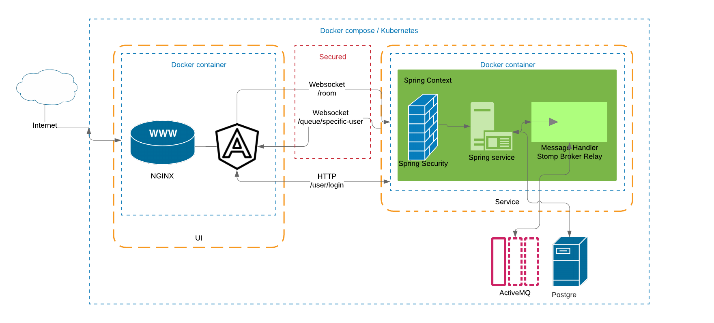

= Action monitor 

## tl;dr

Action monitor is a simple messaging service over STOMP with an ActiveMQ message broker, a PostgreSQL data persistence, an Angular 9 front-end and of course a Spring framework powered Java back-end service.

`docker-compose up` will build/start all the necessary services.

Note: If the service not built locally it will try to pull it from Docher Hub. If it fails please refer the Service/How to build & run/Docker paragraph.

## Architecture

### Service

#### How to build & run

The service is a maven project so for the build just use maven in the project root: `$ mvn clean install`. This will automatically build all module and runs the Checkstyle plugin. The tests are also executed in this phase and a Jacocco report is generated.

NOTE: If there is any checkstyle error, failed tests or the test coverage falls belove 75% the build will *fail*

Also, the application is powered by Spring Boot so the running is as easy as `$ mvn spring-boot:run -pl web` from the project root.

#### Docker

The application is designed to run inside a Docker container. Also, a maven module and profile is provided to make docker image creation a piece of cake.
`$ mvn clean install -Pcontainer` will build the service and creates a docker image `zeletrik/action-monitor-service` with tags `latest` and the current project version.
To run from container just use `docker run --rm -p 8000:8080 zeletrik/action-monitor-service:latest`.

NOTE: By default, the container will run the application with the _container_ Spring profile so the logs will represents as JSONs.

#### Endpoints

|===
|URL | Method | Description

|/info/version
|HTTP GET
|Retrieves the application's version

|/info/health
|HTTP GET
|Retrieves the application's health status

|/user/login
|HTTP POST
|Authenticates the user

|/user/logout
|HTTP GET
|Deletes the current session

|/user/current
|HTTP GET
|Protected - Retrieves the current user

|/user/others
|HTTP GET
|Protected - Retrieves all users excluding the current one

|/secured/user/queue/specific-user-{user-session}
|WebSocket Subscribe
|Protected - Subscribe for messages for the current user

|/secured/room
|WebSocket Send
|Protected - Send message to the specified user
|===

#### Tests

The project uses TestNG for unit tests. Generates report via Jacocco and breaks the build if the 75% coverage not met. For mocking, Mockitio is in use, for assertions Hamcrest is utilized.

### UI

The front-end is written in TypeScript with Angular 9 framework. It utilizes an angular-material library as well. The main dependency is StompJS and StockJS for easy WebSocket communication.

The UI is also designed to run in a Docker container. However, it not provides any wrapper way to do it so the Dockerfile is multi-staged. To build the image just `$ docker build -t action-monitor-ui:latest .` from the UI root directory.

To run it on test environment just use `$ npm start` and it will start a Webpack server on `localhost:4200`

### Persistence

PostgreSQL is used for the database because it's lightweight and easy to manage. A pre-loaded database can be build from the database directory via `$ docker build -t action-monitor-db:latest .`

### Messaging

ActiveMQ is used for message broker it can start from the compose file or via a standalone docker command.